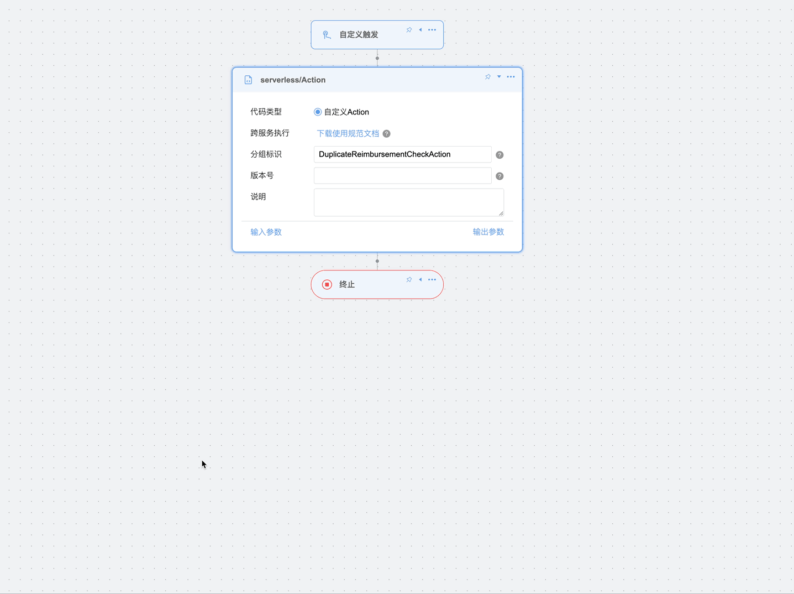

# 泛微 E10 公共类库说明
本项目为本人开发的公共类库，包含了通用的工具类和组件，为二次开发提供便利，你可以把它引入到自己的二开项目中。
大家可以上传自己的代码到本项目中，完善此项目。

## 本项目宗旨
我希望它能打造成一个大家都可以用到的公共类库，每个人都可以上传自己的代码，这样大家都可以用到。

## E9 公共类库
感兴趣可以看我另一个项目，这是一个适用于 E9 系统的二开公共类库，地址：https://github.com/YaoLilin/weaver-e9-common

## 代码上传说明
代码需符合规范，例如阿里巴巴规范，谷歌规范。不得修改现有方法签名，防止破坏正在使用到的项目。不能使用外部依赖。

## 使用方法
### 一、将源码放入你的项目
本项目属于泛微二次开发，需自行搭建泛微二次开发环境。  
下载此项目，将源码放入你的项目中，建议单独放入一个模块，打包部署到系统时合并此模块的代码到你的 jar 包中。
### 二、最简单方法-使用本项目下的jar包
下载本项目下的 `secondev-liuzhou-common-1.0.0.jar` 包，在你的项目中引入此 jar 包，将它作为外部依赖部署到系统中。

## 主要功能 👏
### SqlExecuteClient - sql执行客户端

**路径**：`com.weaver.seconddev.hnweaver.common.SqlExecuteClient`  
**说明**：sql 执行的封装。E10 的 sql 执行相比 E9 更复杂一些，`SqlExecuteClient` 可以简化 sql 执行操作，可以像 E9 的
`RecordSet` 一样传入 sql 语句和参数即可执行 sql

**功能**：

- SQL执行封装：简化E10复杂的SQL执行操作，提供类似E9 RecordSet的使用体验
- 参数化查询：支持SqlParam对象数组和Object数组两种参数传递方式
- 查询和修改支持：同时支持SELECT查询和INSERT/UPDATE/DELETE修改操作
- 字段值获取：提供忽略大小写的字段值获取工具方法

**使用示例**：  
```java
String sql = "SELECT " + fieldName + " FROM " + tableName + " WHERE id = ?";
SqlExecuteResult result = sqlExecuteClient.executeSql(groupType, sql, dataId);
if (!result.isSuccess()) {
    log.error("查询字段值失败，sql：{}，错误信息：{}", sql, result.getMessage());
    throw new SqlExecuteException("查询字段值失败，sql：" + sql + ",错误信息：" + result.getMessage());
}
// 获取查询数据
List<Map<String, Object>> records = result.getRecords();
```
### AbstractEsbAction - ESB 动作流抽象类

**路径**：`com.weaver.seconddev.hnweaver.common.AbstractEsbAction`  
**说明**：可实现此抽象类来替换标准的 `EsbServerlessRpcRemoteInterface` 接口，可明确传入参数和返回参数类型，
替换原来的 Map 形式。在原来的标准接口中传入参数和返回类型是 Map ，在使用时会让类型变得不明确，在 `AbstractEsbAction`
类这些都可以为明确的对象类型，你可以创建传入的参数和返回结果的类型。

**功能**：

- 类型安全：支持明确的输入参数类型T和输出参数类型R，避免Map类型的不确定性
- 参数转换：自动将Map类型的输入参数转换为具体的对象类型
- 异常处理：内置异常捕获和日志记录，提供详细的错误信息
- 结果封装：统一的结果返回格式，简化错误处理

**使用示例**：  
```java
@Slf4j
@RequiredArgsConstructor
@Service("MessagePushToWiseduHelpAction")
public class MessagePushToWiseduHelpAction extends AbstractEsbAction<MessagePushToWiseduHelpAction.InputParams,
        MessagePushToWiseduHelpAction.OutputParams> {

    private final JinzhiTokenManager tokenManager;
    private final HrmCommonEmployeeService employeeService;

    @Override
    protected WeaResult<OutputParams> doExecute(InputParams params) {
        if (StrUtil.isBlank(params.getReceiverIds())) {
            log.error("[receiverIds] 参数为空");
            return WeaResult.fail("[receiverIds] 参数为空");
        }
        // ...业务代码
        return WeaResult.success(outputParams);
    }

    @Override
    protected InputParams convertToParamObj(Map<String, Object> params) {
        return convertToParamObj(params, InputParams.class);
    }

    /**
     * 自定义传入参数类型
     */
    @Data
    public static class InputParams {
        private String receiverIds;
    }

    /**
     * 自定义输出参数类型
     */
    @Data
    public static class OutputParams {
        private String token;
        private String sign;
        private List<String> receiverJobNums;
    }
}
```

#### Action 参数自动获取


继承 `AbstractEsbAction` 的 Action 可通过参数查询接口自动解析输入、输出参数，用于动作流参数配置页面自动填充参数表格。

**使用要求**：

- Action 必须使用 `@Service("ActionGroupId")` 声明 Bean 名称；`ActionGroupId` 即接口中的 `groupId`。
- `AbstractEsbAction` 的输入、输出泛型必须为具体对象类型，不能使用 `Object`、`Map` 或未指定的泛型。
- 可在字段上使用 `@ActionParam` 定义显示名称、描述、是否必填和默认值。
- 支持普通字段、嵌套对象和 `List<对象>`；嵌套对象的字段会作为子参数返回。

**参数定义示例**：
```java
@Service("ExampleAction")
public class ExampleAction extends AbstractEsbAction<ExampleAction.InputParams, ExampleAction.OutputParams> {

    @Data
    public static class InputParams {
        @ActionParam(required = true, displayName = "流程请求ID", desc = "流程请求记录ID")
        private Long requestId;

        @ActionParam(displayName = "明细数据", desc = "报销明细列表")
        private List<DetailData> detailDataList;
    }

    @Data
    public static class DetailData {
        @ActionParam(required = true, displayName = "用户ID")
        private Long userId;
    }

    @Data
    public static class OutputParams {
        @ActionParam(displayName = "处理结果")
        private String result;
    }
}
```

**查询接口**：

| 参数类型 | 请求地址 |
|--------|----------|
| 输入参数 | `GET /api/secondev/esb/action/params/input?groupId=ExampleAction` |
| 输出参数 | `GET /api/secondev/esb/action/params/output?groupId=ExampleAction` |

接口统一返回 `WeaResult`。参数项包含 `name`、`showName`、`required`、`type`、`javaType`、`defaultValue`、`desc` 和 `children`；`children` 用于表示嵌套对象或 List 对象的子参数。

##### 在前端进行自动参数获取
需要导入 `ecode` 文件夹内的 ecode 应用包到系统内，并发布，在动作流设计页面中就能自动获取 Action 参数。
[动作流Action参数自动获取.zip](ecode/%E5%8A%A8%E4%BD%9C%E6%B5%81Action%E5%8F%82%E6%95%B0%E8%87%AA%E5%8A%A8%E8%8E%B7%E5%8F%96.zip)

### HmacSM3Action - HMAC-SM3 加密 动作流 Action

**路径**：`com.weaver.seconddev.hnweaver.common.encryption.HmacSM3Action`  
**说明**：基于 SM3 哈希算法的 HMAC 消息认证码实现，用于带密钥的消息完整性校验和来源认证。底层依赖 Hutool 的 `SmUtil.hmacSm3()`，严格遵循 RFC 2104 标准。

**功能**：

- 消息认证：通过共享密钥对消息进行签名，确保消息完整性和来源真实性
- 参数校验：自动校验密钥和加密内容是否为空
- 统一返回：继承 `AbstractEsbAction`，提供标准化的动作流返回格式
- 国密支持：基于国家密码标准 SM3 算法，满足国产化要求

**使用示例**（E10 动作流调用参数）：
```json
{
    "key": "mySecretKey",
    "content": "待加密的消息内容"
}
```

**返回结果**（动作流输出参数）：
```json
{
    "result": "66c7f0f462eeedd9d1f2d46bdc10e4e24167c4875cf2f7a2297da02b8f4af8df"
}
```

输出参数为 `Map<String, Object>` 类型，包含一个 key 为 `result` 的 64 位十六进制 HMAC-SM3 摘要字符串。

#### Action xml 文件配置
要在配置文件配置此 Action 才能在动作流中使用。在 `/ecode/monitor/loom/deploy/jar` 页面编辑配置文件，在 beans 标签中加入：
```xml
<dubbo:service ref="HmacSM3Action"
               interface="com.weaver.esb.api.rpc.EsbServerlessRpcRemoteInterface"
               group="HmacSM3Action" />
```

### SM4EcbEncodeAction - SM4 ECB 加密 动作流 Action

**路径**：`com.weaver.seconddev.hnweaver.common.encryption.SM4EcbEncodeAction`  
**说明**：基于 SM4 算法的 ECB 模式对称加密实现，支持普通文本和 Hex 两种密钥格式，加密结果支持 Hex 和 Base64 两种输出格式。底层依赖 Hutool 的 `SmUtil.sm4()`。可与 E10 内置 `SM4ECBDecode` 函数配合使用。

**功能**：

- 密钥双模式：支持 TEXT（普通文本，补齐/截断至 16 字节）和 HEX（十六进制解码为 16 字节）两种密钥格式
- 输出双格式：支持 HEX 十六进制和 Base64 两种输出格式
- 参数校验：自动校验密钥和加密内容是否为空
- 统一返回：继承 `AbstractEsbAction`，提供标准化的动作流返回格式
- 国密支持：基于国家密码标准 SM4 算法，满足国产化要求

**输入参数**：

| 参数名 | 类型 | 默认值 | 说明 |
|--------|------|--------|------|
| `content` | String | 必填 | 待加密内容 |
| `key` | String | 必填 | SM4 加密密钥 |
| `keyType` | String | TEXT | 密钥类型：TEXT（普通文本）、HEX（十六进制） |
| `outputFormat` | String | HEX | 输出结果类型：HEX（十六进制）、BASE64 |

**使用示例**（E10 动作流调用参数）：
```json
{
    "content": "{\"appId\":\"lgyy_zk\"}",
    "key": "1a183bfdc4f98692c4819111cbe11dad",
    "keyType": "HEX",
    "outputFormat": "HEX"
}
```

**返回结果**（动作流输出参数）：
```json
{
    "result": "bda059fe202b0137bbe613669ba10a2e..."
}
```

#### Action xml 文件配置
```xml
<dubbo:service ref="SM4EcbEncodeAction"
               interface="com.weaver.esb.api.rpc.EsbServerlessRpcRemoteInterface"
               group="SM4EcbEncodeAction" />
```

### SM4EcbDecodeAction - SM4 ECB 解密 动作流 Action

**路径**：`com.weaver.seconddev.hnweaver.common.encryption.SM4EcbDecodeAction`  
**说明**：基于 SM4 算法的 ECB 模式对称解密实现，支持普通文本和 Hex 两种密钥格式，密文需为 Hex 编码字符串。底层依赖 Hutool 的 `SmUtil.sm4()`。可与 `SM4EcbEncodeAction` 或 E10 内置 `SM4ECBEncode` 函数配合使用。

**功能**：

- 密钥双模式：支持 TEXT（普通文本，补齐/截断至 16 字节）和 HEX（十六进制解码为 16 字节）两种密钥格式
- 参数校验：自动校验密钥和密文是否为空
- 统一返回：继承 `AbstractEsbAction`，提供标准化的动作流返回格式
- 国密支持：基于国家密码标准 SM4 算法，满足国产化要求

**输入参数**：

| 参数名 | 类型 | 默认值 | 说明 |
|--------|------|--------|------|
| `content` | String | 必填 | Hex 编码的密文 |
| `key` | String | 必填 | SM4 解密密钥 |
| `keyType` | String | TEXT | 密钥类型：TEXT（普通文本）、HEX（十六进制） |

**使用示例**（E10 动作流调用参数）：
```json
{
    "content": "bda059fe202b0137bbe613669ba10a2e...",
    "key": "1a183bfdc4f98692c4819111cbe11dad",
    "keyType": "HEX"
}
```

**返回结果**（动作流输出参数）：
```json
{
    "result": "{\"appId\":\"lgyy_zk\"}"
}
```

#### Action xml 文件配置
```xml
<dubbo:service ref="SM4EcbDecodeAction"
               interface="com.weaver.esb.api.rpc.EsbServerlessRpcRemoteInterface"
               group="SM4EcbDecodeAction" />
```

### EbFormDataChangeClient - EB 表单数据修改客户端

**路径**：`com.weaver.seconddev.hnweaver.common.EbFormDataChangeClient`  
**说明**：EB表单数据修改客户端，通过调用标准 RPC 接口进行导入和修改ebuilder表单数据。支持批量插入、更新表单数据，可根据ID、条件或条件字段进行批量更新，支持字段类型转换、文件字段转换、异步处理等功能。适用于需要批量操作表单数据的场景。

**功能**：

- 批量插入：支持同一表单的批量数据插入操作
- 多种更新方式：支持按ID更新、按条件更新、按条件字段更新
- 字段转换：支持自定义字段类型转换和文件字段转换
- 明细表处理：支持主表和明细表数据的级联更新
- 异步处理：支持同步和异步的数据处理模式

**字段转换器体系**：

`EbFormDataChangeClient` 在导入数据时，通过字段转换器体系将原始数据转换为EB表单可识别的格式：

| 转换器 | 路径 | 说明 |
|--------|------|------|
| `FieldConvertor` (接口) | `com.weaver.seconddev.hnweaver.common.service.FieldConvertor` | 字段转换器接口，定义 `convert()` 和 `getComponentKey()` 方法 |
| `EbFieldConvertorGruopInterface` (接口) | `com.weaver.seconddev.hnweaver.common.service.EbFieldConvertorGruopInterface` | 字段转换器组接口，获取不同类型的字段转换器集合 |
| `DefaultEbFieldConvertorGroup` | `...service.impl.DefaultEbFieldConvertorGroup` | 默认转换器组，聚合文件/人员/部门/选择器四个转换器 |
| `FileFieldConvertor` | `...service.impl.FileFieldConvertor` | 文件上传字段转换，支持文件路径读取和大小写不敏感的路径解析 |
| `EmployeeFieldConvertor` | `...service.impl.EmployeeFieldConvertor` | 人员字段转换，支持按姓名查询人员ID |
| `DepartmentFieldConvertor` | `...service.impl.DepartmentFieldConvertor` | 部门字段转换，支持按名称查询部门ID |
| `SelectorFieldConvertor` | `...service.impl.SelectorFieldConvertor` | 选择类型字段转换，支持单选/多选/下拉框等类型 |
| `FieldConvertHelpUtil` | `...util.FieldConvertHelpUtil` | 字段转换辅助工具，处理浏览框类型字段转换 |

**字段转换器注入**：

`EbFormDataChangeClient` 通过 Lombok `@Setter` 提供了 `fieldConvertorGroup` 和 `fileFieldConvertor` 的 setter 方法，可自定义字段转换逻辑。

```java
@Autowired
private EbFormDataChangeClient ebFormDataChangeClient;
@Autowired
private DefaultEbFieldConvertorGroup fieldConvertorGroup;
@Autowired
private FileFieldConvertor fileFieldConvertor;

// 设置字段转换器组（支持人员/部门/选择器字段的自动转换）
ebFormDataChangeClient.setFieldConvertorGroup(fieldConvertorGroup);
// 设置自定义文件上传字段转换器
// 如不传入则使用默认的文件上传字段转换处理
ebFormDataChangeClient.setFileFieldConvertor(fileFieldConvertor);
```

**转换优先级**（从高到低）：
1. `FormFieldData.convertFunc` — 字段级别自定义转换函数
2. `fieldConvertorGroup` 中对应组件类型的转换器
3. `fileFieldConvertor` — 文件上传字段的默认转换器

**使用示例**：
```java
@Autowired
private EbFormDataChangeClient ebFormDataChangeClient;

// 批量插入表单数据示例
public void batchInsertExample(long formId) {
    // 创建表单数据列表
    List<FormData> formDataList = new ArrayList<>();
    
    // 创建第一条数据
    FormData formData1 = new FormData();
    formData1.setFormId(formId);
    
    // 设置主表字段数据
    List<FormFieldData> mainFieldData1 = new ArrayList<>();
    mainFieldData1.add(new FormFieldData("title", "测试标题1"));
    mainFieldData1.add(new FormFieldData("content", "测试内容1"));
    mainFieldData1.add(new FormFieldData("create_date", "2024-01-01"));
    formData1.setMainFieldData(mainFieldData1);
    
    // 创建第二条数据
    FormData formData2 = new FormData();
    formData2.setFormId(formId);
    
    List<FormFieldData> mainFieldData2 = new ArrayList<>();
    mainFieldData2.add(new FormFieldData("title", "测试标题2"));
    mainFieldData2.add(new FormFieldData("content", "测试内容2"));
    mainFieldData2.add(new FormFieldData("create_date", "2024-01-02"));
    formData2.setMainFieldData(mainFieldData2);
    
    formDataList.add(formData1);
    formDataList.add(formData2);
    
    // 执行批量插入
    ResultAndMsg result = ebFormDataChangeClient.batchInsert(formDataList, formId, null);
    if (result.isSuccess()) {
        log.info("批量插入成功");
    } else {
        log.error("批量插入失败：{}", result.getMessage());
    }
}

// 批量更新表单数据示例
public void batchUpdateExample(long formId) {
    // 创建要更新的数据
    List<FormData> formDataList = new ArrayList<>();
    
    FormData formData = new FormData();
    formData.setFormId(formId);
    
    // 设置要更新的字段（必须包含ID字段用于定位记录）
    List<FormFieldData> mainFieldData = new ArrayList<>();
    mainFieldData.add(new FormFieldData("id", "12345")); // 记录ID
    mainFieldData.add(new FormFieldData("title", "更新后的标题"));
    mainFieldData.add(new FormFieldData("status", "1")); // 状态字段
    formData.setMainFieldData(mainFieldData);
    
    formDataList.add(formData);
    
    // 创建更新操作（按ID更新）
    EBDataReqOperation operation = new EBDataReqOperation();
    operation.setUpdateType(EBDataUpdateType.ids);
    
    // 执行批量更新
    ResultAndMsg result = ebFormDataChangeClient.batchUpdate(
        formDataList, formId, operation, DetailUpdateType.UPDATE, null);
    
    if (result.isSuccess()) {
        log.info("批量更新成功");
    } else {
        log.error("批量更新失败：{}", result.getMessage());
    }
}
```

### UserProvider - 用户提供者

**路径**：`com.weaver.seconddev.hnweaver.common.UserProvider`  
**说明**：用户提供者，用于获取当前用户或系统管理员用户。在远程调用 Action 等场景中，`UserContext.getCurrentUser()` 可能获取不到当前用户，此时可通过 `UserProvider` 获取系统管理员用户作为替代。需在配置文件中配置系统管理员用户ID。

**功能**：

- 获取当前用户或系统管理员：优先返回当前用户，为空时自动降级为系统管理员
- 获取系统管理员：直接获取配置的管理员用户
- 配置驱动：通过 `weaver-secondev-service.properties` 中的 `sysadminUserId` 参数指定管理员用户ID

**使用示例**：
```java
@Autowired
private UserProvider userProvider;

public void someMethod() {
    Optional<SimpleEmployee> user = userProvider.getCurrentUserOrSysadminUser();
    user.ifPresent(employee -> {
        // 使用用户信息
    });
}
```

### FieldInfoService - 字段信息接口

**路径**：`com.weaver.seconddev.hnweaver.common.service.FieldInfoService`  
**说明**：表单字段信息服务接口，提供获取表单字段信息的功能。支持根据表单ID获取所有字段信息、根据字段名称或ID获取特定字段信息，以及获取字段选项名称等操作。用于表单字段的元数据查询和管理。

**功能**：

- 字段信息查询：根据表单ID获取所有字段信息，支持主表和明细表字段
- 字段名称查询：根据表单ID和字段名称获取特定字段信息
- 字段ID查询：根据字段ID直接获取字段信息
- 选项名称获取：根据字段ID和值获取字段选项的显示名称

### FormDataService - 表单数据接口

**路径**：`com.weaver.seconddev.hnweaver.common.service.FormDataService`  
**说明**：工作流表单数据服务接口，提供表单字段值的查询、更新和存在性检查功能。支持根据表名和字段名进行字段值的CRUD操作，用于在工作流中对表单数据进行基本的读写操作。

**功能**：

- 字段值查询：根据表名、字段名和数据ID查询字段值
- 字段值更新：根据表名、字段名和数据ID更新字段值
- 存在性检查：检查指定字段值是否在数据库中存在
- 数据源支持：支持不同数据源组的数据库操作

### FormInfoService - 表单信息接口

**路径**：`com.weaver.seconddev.hnweaver.common.service.FormInfoService`  
**说明**：表单信息服务接口，提供获取表单基本信息的功能。支持根据表单ID或表名查询表单信息，以及获取明细表和主表之间的关联关系。用于表单元数据的查询和管理。

**功能**：

- 表单ID查询：根据表单ID获取完整的表单信息
- 表名查询：根据数据库表名获取表单信息
- 明细表查询：根据表名获取明细表ID
- 主从表关联：根据明细表名查询对应的主表ID

### WorkflowInfoService - 工作流信息接口

**路径**：`com.weaver.seconddev.hnweaver.common.service.WorkflowInfoService`  
**说明**：工作流信息服务接口，提供工作流相关的数据查询功能。支持根据流程请求ID查询对应的表单数据ID，用于在工作流处理过程中获取表单数据的关联信息。

**功能**：

- 请求ID映射：根据工作流请求ID查询对应的表单数据ID
- 数据关联查询：支持工作流与表单数据的关联关系获取

## 工具类

### SqlUtil - SQL 构建工具类

**路径**：`com.weaver.seconddev.hnweaver.common.util.SqlUtil`  
**说明**：SQL 语句构建工具类，提供常用的 SQL 片段生成方法，方便在代码中动态拼接 SQL。

**功能**：

- 查询语句构建：根据字段名集合和表名生成 SELECT 查询语句，支持表别名
- 更新语句构建：根据字段名集合生成 UPDATE 语句的 SET 部分
- 插入语句构建：根据字段名集合生成 INSERT 语句，值部分使用占位符
- 条件语句构建：根据条件 Map 生成 WHERE 相等条件语句，支持占位符参数收集

**使用示例**：
```java
List<String> fields = CollUtil.toList("name", "age", "email");
String sql = SqlUtil.buildQuerySql(fields, "user_table");
// 结果: SELECT name,age,email FROM user_table

List<Object> params = new ArrayList<>();
Map<String, Object> conditions = new HashMap<>();
conditions.put("status", 1);
String where = SqlUtil.buildEqualsWhere(conditions, params);
// 结果: WHERE status = ?，params 包含 [1]
```

### WebFileDownloadUtil - 文件下载响应工具类

**路径**：`com.weaver.seconddev.hnweaver.common.util.WebFileDownloadUtil`  
**说明**：接口生成文件下载响应的工具类，用于让 REST 接口返回文件下载。支持中文文件名正确编码、跨域访问头设置等。

**功能**：

- 文件下载响应：将文件写入 HTTP 响应流，支持下载
- 中文文件名：使用 URLEncoder 正确处理中文文件名
- 跨域支持：允许前端访问 Content-disposition 响应头

**使用示例**：
```java
@GetMapping("/download")
public void downloadFile(HttpServletResponse response) {
    File file = new File("/path/to/file.pdf");
    WebFileDownloadUtil.setDownloadResponse(response, file, "文件名.pdf");
}
```

### DataSetUtil - 数据集工具类

**路径**：`com.weaver.seconddev.hnweaver.common.util.DataSetUtil`  
**说明**：数据集 SQL 执行工具类，提供在不同数据源类型上执行 SQL 的能力。支持逻辑表、外部数据源、带事务执行等。

**功能**：

- 逻辑表查询：在 LOGIC 类型数据源上执行 SQL
- 外部数据源查询：在 EXTERNAL 类型外部数据源上执行 SQL，支持预编译参数
- 事务支持：支持开启事务、提交、回滚的聚合执行接口
- 数据源分组查询：获取指定类型的数据源分组信息

### FieldRpcUtil - 表单字段 RPC 工具类

**路径**：`com.weaver.seconddev.hnweaver.common.util.FieldRpcUtil`  
**说明**：表单字段 RPC 工具类，通过 RPC 调用获取表单字段的元数据信息。支持按字段名称查找字段、获取表单所有字段等操作。

**功能**：

- 字段名称查询：根据表单ID和字段名称获取字段信息，支持明细表字段
- 全量字段获取：根据表单ID获取该表所有字段（包括明细字段）
- 多服务支持：通过 RpcGroup 参数区分不同微服务

## 开发者工具

### 日志级别配置修改

**路径**：
- 接口：`com.weaver.seconddev.hnweaver.common.controller.DevToolsController`
- 服务：`com.weaver.seconddev.hnweaver.common.service.ConfigFileService`
- 实现：`com.weaver.seconddev.hnweaver.common.service.impl.ConfigFileServiceImpl`

**说明**：提供 REST 接口便捷修改 `com.weaver.seconddev` 包下代码的日志级别配置，修改后需重启服务生效。无需手动编辑 `weaver-secondev-service.properties` 配置文件，接口会自动在配置文件中添加或更新日志级别配置项。

**功能**：

- 便捷修改日志级别：支持 DEBUG、INFO、WARN、ERROR 级别，自动写入配置文件
- 查看当前配置：查询 `weaver-secondev-service.properties` 中配置的日志级别
- 服务重启生效：配置持久化到配置文件，重启服务后应用新的日志级别

**接口说明**：
| 方法 | 路径 | 说明 |
|------|------|------|
| POST | `/api/secondev/dev-tools/log-level` | 修改日志级别，请求体 `{"level": "DEBUG"}` |
| GET | `/api/secondev/dev-tools/log-level` | 查看当前日志级别 |

### GlobalExceptionHandler - 全局异常处理器

**路径**：`com.weaver.seconddev.hnweaver.common.handler.GlobalExceptionHandler`  
**说明**：全局 REST 接口异常处理器，统一处理 `com.weaver.seconddev.hnweaver` 包下 Controller 抛出的异常。支持自定义业务异常和参数缺失异常的统一返回格式。

### CommonConfigProperties - 公共配置属性

**路径**：`com.weaver.seconddev.hnweaver.common.config.CommonConfigProperties`  
**说明**：公共配置属性类，从 `weaver-secondev-service.properties` 配置文件中读取公共参数。

**配置项**：
| 参数名 | 类型 | 默认值 | 说明 |
|--------|------|--------|------|
| `sysadminUserId` | String | 空 | 系统管理员用户ID，用于 Action 远程调用时获取默认用户 |
| `oaAddress` | String | 空 | OA 系统访问地址 |

## 更多功能
详细信息请看源码

## 欢迎贡献 🎉
如果你有好的工具和功能，欢迎贡献代码
